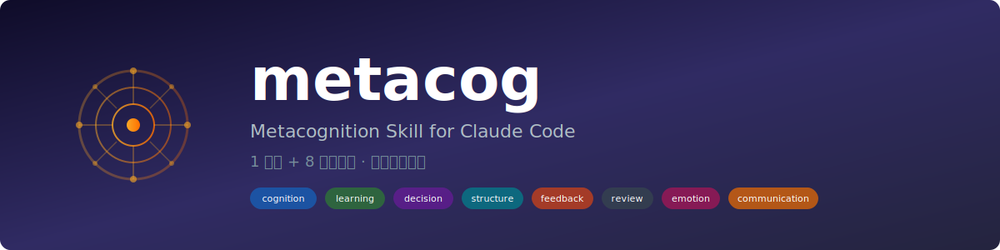
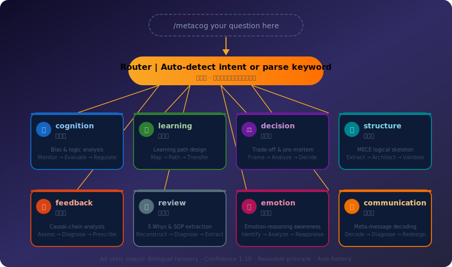
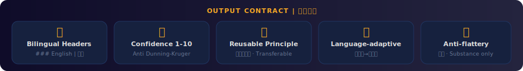
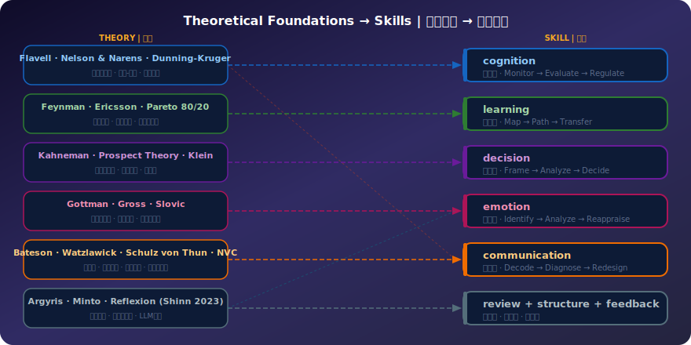

<p align="right">
  <strong>中文</strong> | <a href="README.md">English</a>
</p>

<p align="center">
  
</p>

<p align="center">
  <em>让 AI 从「答案生成器」升级为「认知操作系统」</em>
</p>

---

## metacog 是什么？

**metacog** 是一个 Claude Code 技能，将 8 种元认知能力整合为一个 `/metacog` 命令。它不只是回答问题，而是帮你**升级思考能力本身**。

大多数 AI 交互是：用户提问 → AI 回答。但真正的瓶颈往往不是"答案是什么"，而是**"我问对问题了吗？"** metacog 反转了这个模式——分析思维过程本身。

<p align="center">
  
</p>

---

## 安装

```bash
# 个人级（所有项目可用）
mkdir -p ~/.claude/skills/metacog
cp SKILL.md ~/.claude/skills/metacog/

# 或项目级（仅当前项目）
mkdir -p .claude/skills/metacog
cp SKILL.md .claude/skills/metacog/
```

安装后重启 Claude Code。

---

## 八大技能

| 关键词 | 技能 | 功能 | 理论基础 |
|--------|------|------|---------|
| `cognition` | 元认知 | 诊断思维错误、认知偏差、逻辑漏洞 | Flavell, Dunning-Kruger |
| `learning` | 元学习 | 设计学习路径，识别关键 20% | 费曼技巧, 帕累托, 刻意练习 |
| `decision` | 元决策 | 分析利弊权衡，运行预验尸 | Kahneman 双系统, 前景理论 |
| `structure` | 元结构 | 构建 MECE 逻辑骨架 | 金字塔原理, 麦肯锡 |
| `feedback` | 元反馈 | 追踪 行为→机制→结果 因果链 | Nelson & Narens |
| `review` | 元复盘 | 通过 5 Whys 提炼可复用 SOP | Reflexion, 双环学习 |
| `emotion` | 元情绪 | 分离情绪信号与噪声 | Gottman, Gross, Slovic |
| `communication` | 元沟通 | 解码元信息，修复意图-效果偏差 | Bateson, Watzlawick, NVC |

---

## 使用方法

### 自动路由 — 自然描述你的情况
```
/metacog 我每天学8小时但考试成绩很差
→ Routing → learning | 元学习
→ （识别流畅性幻觉，设计主动回忆路径）
```

### 指定关键词 — 直接选择技能
```
/metacog decision 我在考虑要不要辞职去创业
→ （决策原则、利弊矩阵、预验尸、兜底方案）
```

### 全能模式 — 多技能管线处理复杂问题
```
/metacog all 我一看到那个任务就焦虑然后一直拖
→ 运行 emotion + cognition + feedback → 综合分析
```

---

## 输出规范

每个技能的输出都保证包含以下 5 项：

<p align="center">
  
</p>

---

## 理论基础

每项技能都基于经过同行评审的学术框架，不是凭感觉设计的。

<p align="center">
  
</p>

<details>
<summary><strong>Nelson & Narens 监控-控制模型 (1990)</strong> — 系统核心操作模型</summary>

两个认知层级交互：
- **监控层**：元层级从对象层级获取信息（"我做得怎么样？"）
- **控制层**：元层级修改对象层级的过程（"我需要换个策略"）

metacog 的每个技能都遵循这个模式：先监控用户的思维，再提供控制行动。
</details>

<details>
<summary><strong>Kahneman 双系统理论 (2011)</strong> — 为什么需要元认知</summary>

- **系统1**：快速、自动、直觉、易出错
- **系统2**：缓慢、刻意、理性、耗能

元认知本质上是用系统2去审视系统1。
</details>

<details>
<summary><strong>Gottman 元情绪哲学 (1996)</strong> — 你对情绪的态度</summary>

- **情绪觉察型**：识别 → 命名 → 理解
- **情绪忽视型**：否认 → 压抑 → 回避

`emotion` 技能实现觉察型路径：把情绪当数据，而非要压制的噪声。
</details>

<details>
<summary><strong>Argyris 双环学习 (1978)</strong> — 质疑模型本身</summary>

- **单环学习**：行为出错 → 修正行为
- **双环学习**：行为出错 → 质疑假设 → 修正心智模型

`review` 技能不仅问"什么做错了"，还问"什么信念是错的"。
</details>

---

## 设计决策

| 决策 | 原因 |
|------|------|
| **单文件架构** | 用户只需记住一个命令 `/metacog`，路由器处理复杂度 |
| **双语标题** | 英文确保 LLM 处理精度；中文提供直觉理解 |
| **置信度 1-10** | 对抗 Dunning-Kruger 效应，校准 AI 和用户的确信程度 |
| **反媚原则** | 所有输出必须经受"删掉所有好话后还剩什么？"的测试 |
| **可复用原则** | 每次交互都提炼一条跨场景通用的认知工具 |

### 技能区分

| | cognition 元认知 | emotion 元情绪 |
|---|---|---|
| 目标 | 思维错误、逻辑偏见 | 情绪状态、情感扭曲 |
| 核心问题 | "我的推理有效吗？" | "我在感受什么？它如何扭曲判断？" |
| 反模式 | "你说得对"（恭维） | "别想太多"（否认） |

| | structure 元结构 | communication 元沟通 |
|---|---|---|
| 目标 | 信息架构、逻辑组织 | 人际信息动态、关系层面 |
| 核心问题 | "这组织得清楚吗？" | "这里真正在传达什么？" |
| 反模式 | "都重要"（扁平） | "说实话就好"（天真） |

---

## 反模式清单

以下输出在所有技能中**严格禁止**：

| 反模式 | 错误示例 | 正确做法 |
|--------|---------|---------|
| 恭维 | "你能思考这个问题说明你很有自省力" | 直接分析问题 |
| 鸡汤 | "相信自己，你一定可以的" | 给出具体可执行的步骤 |
| 敷衍 | "这要看具体情况" | 列出关键变量并给出条件判断 |
| 否认情绪 | "别想太多" | 精确命名情绪并分析其影响 |
| 天真建议 | "说实话就好了" | 分析沟通动态并给具体话术 |
| 扁平化 | "都很重要" | 明确优先级排序 |
| 幻觉填充 | 在信息不足时编造答案 | 明确指出缺失信息并追问 |

---

## 参考文献

**核心文献**：Flavell (1979), Schraw & Dennison MAI (1994), Nelson & Narens (1990), Kahneman (2011), Kruger & Dunning (1999), Ericsson (1993), Gottman (1996), Gross (1998), Slovic (2007), Bateson (1972), Watzlawick (1967), Schulz von Thun (1981), Rosenberg (2003), Argyris (1978), Minto (2009), Shinn (2023).

**参考项目**：[atscub/metacognition](https://github.com/atscub/metacognition) · [thinking-partner](https://github.com/mattnowdev/thinking-partner) · [LangGPT](https://github.com/langgptai/LangGPT)

---

## 完整文档

用浏览器打开 [`docs/index.html`](docs/index.html) 查看交互式文档，包含可视化理论图解和技能详情。

---

<p align="center">
  <em>思考你的思考。学习你的学习。决定你的决定。</em><br>
  MIT 许可证
</p>
