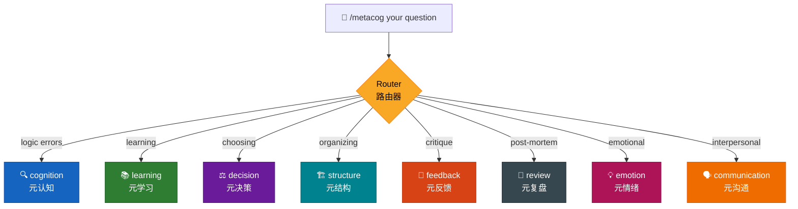
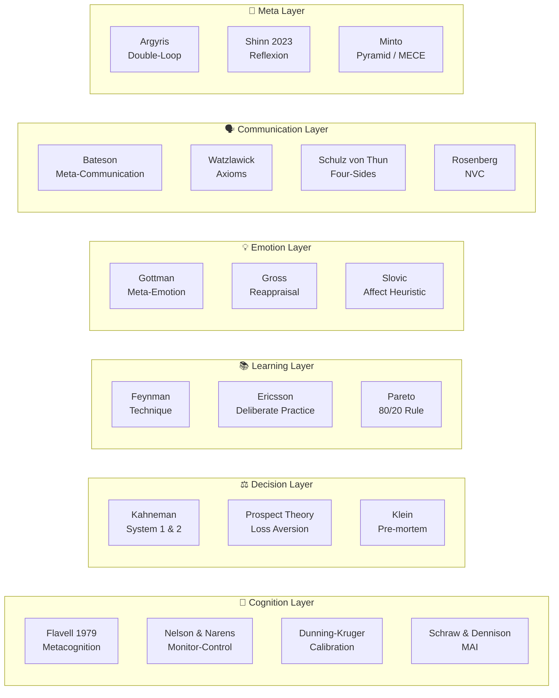

<p align="center">
  
</p>

<p align="center">
  <strong>Metacognition Skill for Claude Code</strong><br>
  让 AI 从"答案生成器"升级为"认知操作系统"<br>
  <em>Upgrade AI from answer-generator to cognitive operating system</em>
</p>

<p align="center">
  <a href="#installation--安装">Installation</a> •
  <a href="#skills-overview--技能总览">Skills</a> •
  <a href="#usage--使用方法">Usage</a> •
  <a href="#design-philosophy--设计哲学">Design</a> •
  <a href="#theoretical-foundations--理论基础">Theory</a>
</p>

---

## What is this? | 这是什么？

**metacog** is a single Claude Code skill that packs 8 metacognitive capabilities into one command. Instead of just answering your questions, it helps you **think better about thinking itself**.

**metacog** 是一个 Claude Code 技能，将 8 种元认知能力整合为一个命令。它不只是回答问题，而是帮你**升级思考能力本身**。

```
/metacog I'm stuck between two job offers
→ Auto-routes to decision skill
→ Analyzes trade-offs, hidden costs, runs pre-mortem
→ Gives optimal choice + fallback plan
```

---

## Installation | 安装

### Option 1: Download ZIP

1. Download `metacognition.zip` from [Releases](https://github.com/JimmyWangJimmy/metacog/releases)
2. Extract — you get a single `SKILL.md` file
3. Place it:

```bash
# Project-level (this project only)
mkdir -p .claude/skills/metacog
cp SKILL.md .claude/skills/metacog/

# Personal (all your projects)
mkdir -p ~/.claude/skills/metacog
cp SKILL.md ~/.claude/skills/metacog/
```

4. Restart Claude Code

### Option 2: Clone

```bash
git clone https://github.com/JimmyWangJimmy/metacog.git
cp metacog/SKILL.md ~/.claude/skills/metacog/SKILL.md
```

---

## Skills Overview | 技能总览

One command, 8 cognitive modes. Use a keyword to pick one, or let the router auto-detect.

一个命令，8 种认知模式。用关键词指定，或让路由器自动识别。



### The 8 Skills | 八大技能

| Keyword | Skill | What it does | Core Theory |
|---------|-------|-------------|-------------|
| `cognition` | 🔍 元认知 | Diagnoses thinking errors, biases, logic gaps | Flavell, Dunning-Kruger |
| `learning` | 📚 元学习 | Designs learning paths, finds the critical 20% | Feynman, Pareto, Ericsson |
| `decision` | ⚖️ 元决策 | Analyzes trade-offs, runs pre-mortems | Kahneman, prospect theory |
| `structure` | 🏗️ 元结构 | Builds MECE logical skeletons | Minto Pyramid, McKinsey |
| `feedback` | 🎯 元反馈 | Traces behavior→mechanism→outcome chains | Nelson & Narens |
| `review` | 🔄 元复盘 | Extracts SOPs from past events via 5 Whys | Reflexion, Argyris |
| `emotion` | 💡 元情绪 | Separates emotional signal from noise | Gottman, Gross, Slovic |
| `communication` | 🗣️ 元沟通 | Decodes meta-messages, fixes intent-impact gaps | Bateson, Watzlawick, NVC |

---

## Usage | 使用方法

### Auto-routing | 自动路由

Just describe your situation. The router picks the best skill.

```
/metacog 我每天学8小时但考试成绩很差
→ Routing → learning | 元学习
→ (analyzes study method, identifies fluency illusion, designs better path)
```

### Explicit keyword | 指定关键词

Put the skill name first.

```
/metacog decision Should I quit my job to start a business?
→ Directly executes decision skill
→ (decision principles, trade-off matrix, pre-mortem, fallback plan)
```

### All mode | 全能模式

Use `all` for complex problems that need multiple perspectives.

```
/metacog all 我一看到那个任务就焦虑然后一直拖
→ Runs emotion + cognition + feedback
→ (names the anxiety, traces the avoidance loop, gives concrete action rules)
→ Synthesis section integrates all insights
```

### Real-world examples | 实战示例

<details>
<summary><strong>Example 1: 创业者犹豫辞职</strong> (Decision)</summary>

```
/metacog 我在考虑要不要辞职去创业
```

Output includes:
- **Decision Principles**: irreversibility, financial runway, opportunity cost
- **Trade-off Analysis**: not just income — career network, identity, psychological safety
- **Risk Warning**: optimism bias, survivorship bias (only seeing success stories)
- **Pre-mortem**: "If you failed in 18 months, what were the top 3 reasons?"
- **Fallback**: side project first, 6-month runway minimum

</details>

<details>
<summary><strong>Example 2: 老板说"你看着办"</strong> (Communication)</summary>

```
/metacog 我老板说"你看着办"但我怎么做他都不满意
```

Output includes:
- **Surface vs Meta-Message**: surface = delegation; meta = test / avoidance
- **Four-sides decode**: factual (handle it) / self-revelation (uncertain) / relationship (you should read my mind) / appeal (do it my way but I won't say how)
- **Pattern**: implicit expectations + post-hoc denial = double bind
- **Suggested Phrasing**: "为了确保方向一致，我想先确认几个关键点：[具体问题]，您看这个方向对吗？"

</details>

<details>
<summary><strong>Example 3: 焦虑导致拖延</strong> (Emotion)</summary>

```
/metacog 我一看到那个任务就焦虑，然后就一直拖
```

Output includes:
- **Emotion Identification**: anxiety + shame ("I shouldn't procrastinate")
- **Emotional Distortion**: anxiety → avoidance → more anxiety (vicious cycle); affect heuristic: "I feel anxious so this task must be impossibly hard"
- **Signal vs Noise**: signal (task may exceed current skills) vs noise (perfectionism)
- **Reappraisal**: reframe "I must do this perfectly" → "I can try 15 minutes to gauge actual difficulty"

</details>

---

## Design Philosophy | 设计哲学

### Why "metacognition"? | 为什么是"元认知"？

Most AI interactions follow a simple pattern:

```
User asks question → AI gives answer
```

This misses the point. The real bottleneck is rarely "what's the answer" — it's **"am I even asking the right question?"**

metacog flips the script:

```
User describes situation → AI analyzes the THINKING PROCESS → User upgrades their cognition
```

大多数 AI 交互是：用户提问 → AI 回答。但真正的瓶颈往往不是"答案是什么"，而是**"我问对问题了吗？"** metacog 反转了这个模式：分析思维过程本身，帮用户升级认知能力。

### Design Decisions | 设计决策

**1. Single file, not 9 separate skills**

We consolidated everything into one `SKILL.md` with an internal router. Why:
- Users only need to remember one command: `/metacog`
- The router handles complexity — users describe their situation naturally
- No namespace pollution with 9 `/meta-*` commands

我们把所有能力合并到一个文件里。用户只需记住 `/metacog` 一个命令。

**2. Bilingual headers | 双语标题**

All output sections use `### English | 中文` format. This serves two purposes:
- English ensures LLM processing precision (model thinks better in English)
- Chinese provides intuitive understanding for Chinese-speaking users
- Works for both audiences without switching modes

**3. Mandatory confidence score | 强制置信度**

Every output includes a 1-10 confidence rating with justification. This directly combats the **Dunning-Kruger effect** — both for the AI and the user:
- Forces the model to calibrate its own certainty
- Signals to the user when to seek additional verification
- Makes epistemic humility structural, not performative

**4. Anti-flattery principle | 反媚原则**

```
❌ "你能思考这个问题说明你很有自省力"
❌ "相信自己，你一定可以的"
❌ "这要看具体情况"

✅ Direct analysis of the actual problem
✅ Concrete, executable next steps
✅ Named biases with evidence
```

All skills are explicitly instructed: **NEVER flatter, reassure, use platitudes, or pad with filler.** Every output must survive the test: "If I delete all compliments and chicken soup, what's left?" If nothing is left, the output failed.

所有技能都明确禁止：恭维、鸡汤、敷衍。每次输出都必须经受得住这个测试："删掉所有好话之后，还剩什么？"

**5. Reusable principles | 可复用原则**

Every interaction extracts one transferable principle. The goal isn't to solve one problem — it's to give you a tool that works across many problems.

每次交互都提炼一条可迁移的原则。目标不是解决一个问题，而是给你一个跨场景通用的工具。

---

## Theoretical Foundations | 理论基础

metacog isn't built on vibes. Every skill maps to established academic frameworks:



### Key Frameworks Explained | 核心框架解释

<details>
<summary><strong>Nelson & Narens Monitor-Control (1990)</strong> — The operating model</summary>

The backbone of this entire system. Two cognitive levels interact:
- **Monitor**: meta-level observes the object-level ("How am I doing?")
- **Control**: meta-level modifies the object-level ("I need to switch strategy")

Every skill in metacog follows this pattern: first monitor the user's thinking, then provide control actions.

这是整个系统的骨干模型。监控层观察执行层（"我做得怎么样？"），控制层修改执行层（"我需要换个策略"）。

</details>

<details>
<summary><strong>Kahneman's Dual Process (2011)</strong> — Why we need metacognition</summary>

- **System 1**: Fast, automatic, intuitive, error-prone
- **System 2**: Slow, deliberate, rational, energy-consuming

Metacognition is essentially using System 2 to audit System 1. The `cognition` and `decision` skills are designed to catch System 1 shortcuts that lead to bias.

元认知本质上是用系统2来审计系统1。

</details>

<details>
<summary><strong>Gottman Meta-Emotion (1996)</strong> — Emotions about emotions</summary>

Your attitude toward your own emotions determines how well you regulate them:
- **Emotion-Coaching**: recognize, name, understand
- **Emotion-Dismissing**: deny, suppress, avoid

The `emotion` skill implements the coaching approach: make emotions legible as data, not something to be suppressed.

你对自己情绪的态度，决定了你调节情绪的效果。

</details>

<details>
<summary><strong>Schulz von Thun Four-Sides (1981)</strong> — Every message has 4 layers</summary>

Every utterance simultaneously communicates:
1. **Factual** — what is said
2. **Self-revelation** — what the speaker reveals about themselves
3. **Relationship** — how the speaker views the listener
4. **Appeal** — what the speaker wants the listener to do

The `communication` skill applies this to decode what's really happening in conversations.

每句话同时传递四层信息：事实、自我揭示、关系、诉求。

</details>

<details>
<summary><strong>Argyris Double-Loop Learning (1978)</strong> — Question the model, not just the action</summary>

- **Single-loop**: action failed → fix the action
- **Double-loop**: action failed → question the assumption that led to the action → fix the mental model

The `review` skill implements double-loop: it doesn't just ask "what went wrong" but "what belief was wrong."

单环学习修正行为，双环学习修正心智模型。

</details>

---

## Architecture | 架构

```
┌─────────────────────────────────────────────┐
│                 /metacog                     │
│            ┌──────────────┐                  │
│            │   Router     │                  │
│            │  (auto or    │                  │
│            │   keyword)   │                  │
│            └──────┬───────┘                  │
│     ┌──────┬──────┼──────┬──────┐            │
│     ▼      ▼      ▼      ▼      ▼            │
│ ┌───────┬───────┬───────┬───────┬───────┐    │
│ │cognit.│learn. │decis. │struct.│feedbk.│    │
│ └───────┴───────┴───────┴───────┴───────┘    │
│ ┌───────┬───────┬───────┐                    │
│ │review │emot.  │commun.│                    │
│ └───────┴───────┴───────┘                    │
│                                              │
│  Global Rules:                               │
│  • Bilingual headers                         │
│  • Confidence 1-10                           │
│  • Reusable principle                        │
│  • Anti-flattery                             │
│  • Language-adaptive                         │
└─────────────────────────────────────────────┘
```

### Skill Differentiation | 技能区分

Some skills seem similar. Here's how they differ:

| | cognition 元认知 | emotion 元情绪 |
|---|---|---|
| **Target** | Thinking errors, logical bias | Emotional states, affective distortion |
| **Core question** | "Is my reasoning valid?" | "What am I feeling and how does it bend my judgment?" |
| **Anti-pattern** | "You're right" (flattery) | "Don't overthink it" (denial) |

| | structure 元结构 | communication 元沟通 |
|---|---|---|
| **Target** | Information architecture | Interpersonal dynamics |
| **Core question** | "Is this organized clearly?" | "What is really being said here?" |
| **Anti-pattern** | "Everything matters" (flat) | "Just be honest" (naive) |

---

## Output Contract | 输出规范

Every skill output **always** includes:

| Component | Purpose |
|-----------|---------|
| Bilingual section headers `### EN \| 中文` | Cross-language accessibility |
| Confidence score (1-10 + reason) | Epistemic calibration (anti Dunning-Kruger) |
| Reusable Principle | Transferable insight beyond this specific case |
| Language-adaptive content | Chinese input → Chinese output (headers stay bilingual) |
| Zero flattery | Substance survives the "delete all compliments" test |

---

## Anti-Patterns | 反模式清单

These outputs are **explicitly forbidden** across all skills:

| Anti-pattern | Example | What to do instead |
|---|---|---|
| Flattery | "你能思考这个问题说明你很有自省力" | Jump straight to analysis |
| Chicken soup | "相信自己，你一定可以的" | Give concrete executable steps |
| Hedging | "这要看具体情况" | List key variables + conditional logic |
| Emotion denial | "别想太多" | Name the emotion precisely, trace its effects |
| Naive advice | "说实话就好了" | Analyze dynamics, give specific phrasing |
| Flattening | "都很重要" | Explicit priority ranking |
| Hallucination | Making up answers when info is missing | State what's missing, then ask |

---

## References | 参考文献

### Core Academic Sources

- **Flavell, J. H.** (1979). Metacognition and cognitive monitoring. *American Psychologist*, 34(10).
- **Schraw, G. & Dennison, R. S.** (1994). Assessing metacognitive awareness. *Contemporary Educational Psychology*, 19(4).
- **Nelson, T. O. & Narens, L.** (1990). Metamemory: A theoretical framework. *Psychology of Learning and Motivation*, 26.
- **Kahneman, D.** (2011). *Thinking, Fast and Slow*. Farrar, Straus and Giroux.
- **Kruger, J. & Dunning, D.** (1999). Unskilled and unaware of it. *JPSP*, 77(6).
- **Ericsson, K. A. et al.** (1993). Deliberate practice in expert performance. *Psychological Review*, 100(3).
- **Gottman, J. M. et al.** (1996). Parental meta-emotion philosophy. *Journal of Family Psychology*, 10(3).
- **Gross, J. J.** (1998). The emerging field of emotion regulation. *Review of General Psychology*, 2(3).
- **Slovic, P. et al.** (2007). The affect heuristic. *European Journal of Operational Research*, 177(3).
- **Bateson, G.** (1972). *Steps to an Ecology of Mind*. University of Chicago Press.
- **Watzlawick, P. et al.** (1967). *Pragmatics of Human Communication*. W. W. Norton.
- **Schulz von Thun, F.** (1981). *Miteinander reden 1*. Rowohlt.
- **Rosenberg, M. B.** (2003). *Nonviolent Communication* (2nd ed.). PuddleDancer Press.
- **Argyris, C. & Schön, D. A.** (1978). *Organizational Learning*. Addison-Wesley.
- **Minto, B.** (2009). *The Pyramid Principle* (3rd ed.). Pearson.
- **Shinn, N. et al.** (2023). Reflexion: Language agents with verbal reinforcement learning. *NeurIPS 2023*.

### Reference Projects

- [atscub/metacognition](https://github.com/atscub/metacognition) — KYL plugin for Claude Code
- [mattnowdev/thinking-partner](https://github.com/mattnowdev/thinking-partner) — 150+ mental models
- [LangGPT](https://github.com/langgptai/LangGPT) — Structured prompt framework (11,900 stars)

---

## License

MIT

---

<p align="center">
  <em>Think about your thinking. Learn about your learning. Decide about your deciding.</em><br>
  <em>思考你的思考。学习你的学习。决定你的决定。</em>
</p>
